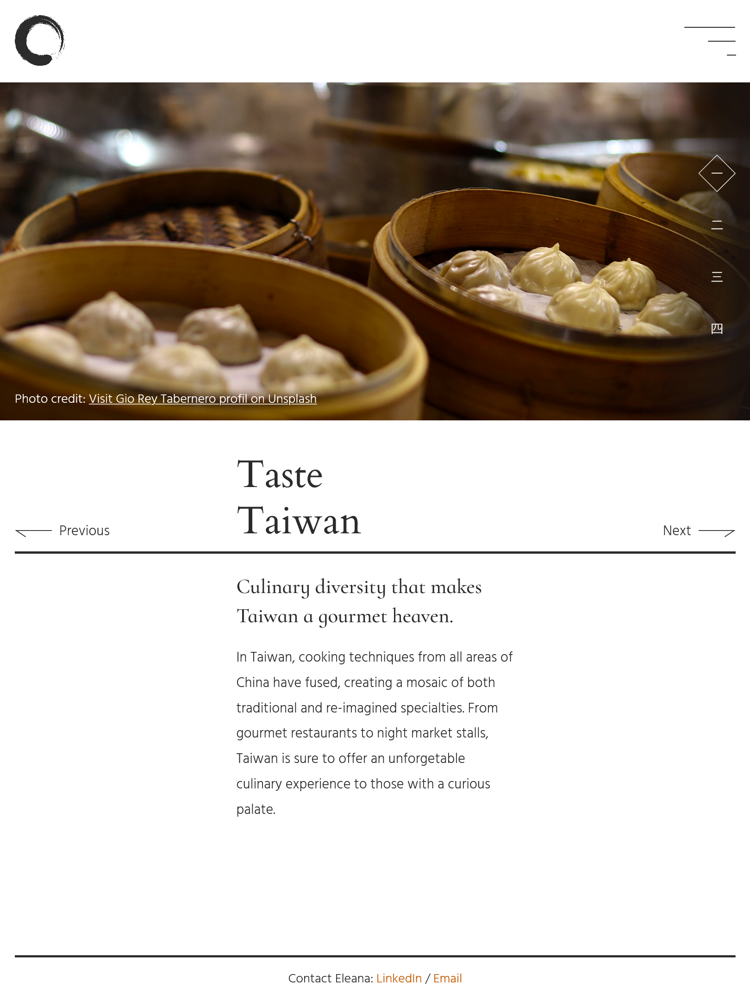

## Table of contents

- [Overview](#overview)
  - [Screenshot](#screenshot)
  - [Links](#links)
- [My process](#my-process)
  - [Built with](#built-with)
  - [Continued development](#continued-development)
- [Author](#author)

## Overview

Hello! Thanks for visiting. I'm Eleana and I'm a Junior Frontend Developer from Greece.

This is an attempt at a responsive fullpage slider with some text and image transitions. The layout changes a little depending on screen sizes. On touch screens the user can also swipe left or right to navigate between slides.

### Screenshot

### Links

- Live Site URL: [GitHub Pages](https://etyradelli.github.io/responsive-slider/)
- Live Site URL: [Codepen](https://codepen.io/eTyradelli/pen/qBPYROZ)

## My process

This was the most JS-heavy project I've worked on yet, so I spent most of time getting things to work. I used local storage to give the user the opportunity to save their preferences. I also used the drag and drop API and the audio API for some extra features.

### Built with

- Semantic HTML5 markup
- CSS custom properties
- Vanilla JavaScript
- Flexbox
- CSS Grid
- BEM
- Mobile-first workflow

### Continued development

Next update on this project will add a working menu toggle.

## Author

Hi, my name is Eleana and I'm a Junior Frontend Developer. 
Feel free to connect with me on Linkedin and say hi :)

- Linkedin - [Eleana Tyradelli](https://www.linkedin.com/in/eleanatyradelli/)
- Codepen - [@eTyradelli](https://codepen.io/eTyradelli)
- Frontend Mentor - [@eTyradelli](https://www.frontendmentor.io/profile/eTyradelli)
